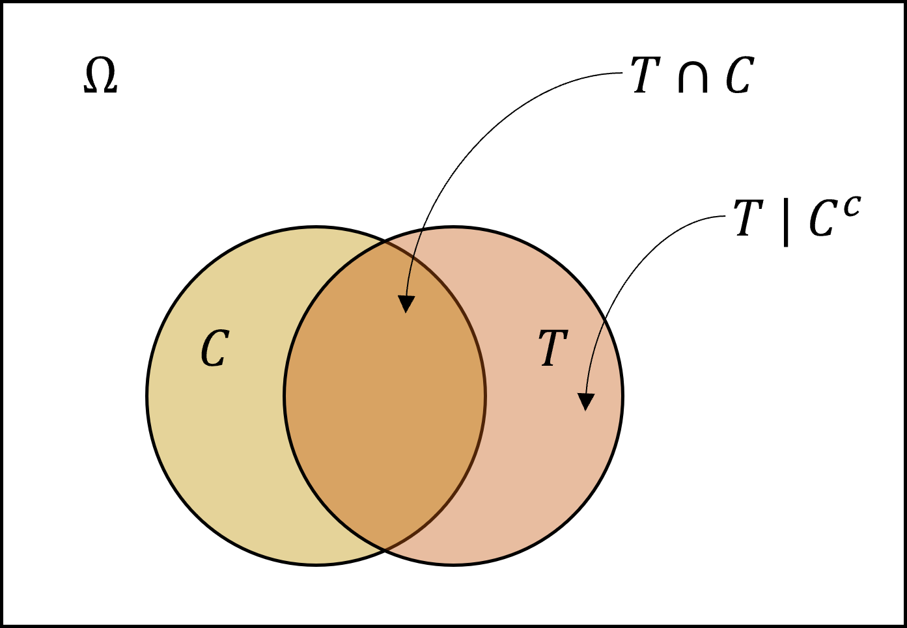

```{r setup, include=FALSE}
knitr::opts_chunk$set(echo = TRUE, fig.width = 4, fig.height = 3)
```

# Loaded packages


```{r warning=FALSE, message=FALSE}
library(ggplot2)
theme_set(theme_classic())
```

# Exercise 1)

**Basic probability theory notation and terms**. Explain each of the following terms with one sentence.

- probability: in repeated trials, proportion of the times that an event occurs.
- probability mass: function that relates the probability of a discrete random variable with some value, given a single or a set of parameters.
- probability density: function that relates the likelihood of a continuous random variable with some value, given a single or a set of parameters.
- probability mass function (pmf): the same as probability mass.
- probability density function (pdf): the same as probability density.
- probability distribution: the pmf or pdf of a discrete or continuous random variable, respectively.
- discrete probability distribution: the same as pmf.
- continuous probability distribution: the same as pdf.
- cumulative distribution function: the accumulated probability or likelihood of a pmf or pdf, respectively.
- likelihood: the probability of the observed data, given a single or a set of parameters.

# Exercise 2)

## a)

Plot the density function of Beta-distribution, with $\mu = 0.2$ and variance $\sigma^2 = 0.01$.

```{r}
mu <- .2
sigma2 <- .01
alpha <- mu * (mu * (1 - mu) / sigma2 - 1)
beta <- alpha * (1 - mu) / mu

ggplot(data = data.frame(x = c(0, 1)), aes(x)) +
  geom_function(fun = dbeta, args = list(shape1 = alpha, shape2 = beta)) +
  labs(x = "X", y = "PDF")
```

## b)

Take a sample of 1000 random numbers from the above distribution and plot a histogram of the results.

```{r warning=FALSE}
sample_data <- rbeta(1000, shape1 = alpha, shape2 = beta)
ggplot(data = data.frame(x = sample_data), aes(x)) +
  geom_histogram(bins = 30, fill = "white", color = "gray20") +
  scale_x_continuous(limits = c(0, 1)) +
  labs(x = "X", y = "Absolute frequency") 
```

## c)

Compute the sample mean and variance form the drawn sample. Verify that they match (roughly) to the true mean and variance of the distribution.

```{r}
sample_mean <- mean(sample_data)
sample_variance <- var(sample_data)

cat("The sample mean is", sample_mean, "an the true mean is", mu,
    "\nThe sample variance is", sample_variance, "and the true variance is", sigma2)
```

## d)

Estimate the central 95% probability interval of the distribution from the drawn samples.

```{r}
interval <- quantile(sample_data, probs = c(.025, .975))
interval
```

# Exercise 3)

**Bayes' theorem**. 

- Test gives a positive result in 98% of the time when the test subject has lung cancer.
- Test gives a negative result in 96 % of the time when the test subject does not have lung cancer.
- In general population approximately one person in 1000 has lung cancer.

Let $C$ be the event of having lung cancer, and $T$ the event of testing positive on lung cancer. 

- $P(C) = 0.001$
- $P(T \mid C) = 0.98 \implies P(T^c \mid C) = 0.02$
- $P(T^c \mid C^c) = 0.96 \implies P(T \mid C^c) = 0.04$

In this case, we are interested in the probability that a subject has lung cancer given that he tested positive, and the probability of not having lung cancer given that he tested negative.

First, we need to find the joint probability between having lung cancer and tested positive.

$$
\begin{aligned}
P(T \mid C) & = \frac{P(T \cap C)}{P(C)} \implies P(T \cap C) = P(T \mid C) \times P(C) \\
P(T \cap C) & = 0.98 \times 0.001 = 0.00098
\end{aligned}
$$

With the joint probability known, then is easy to see that the probability of a positive outcome of the test is $P(T) = P(T \cap C) + P(T \mid C^c) = 0.04098$, as shown by the illustration below.

```{r, out.width = "300px", echo=FALSE}

```

Then, the probability of having cancer given a positive result, can be derived from the Bayes' theorem.

$$
\begin{aligned}
P(C \mid T) & = \frac{P(T \mid C) \times P(C)}{P(T)} = \frac{P(T \cap C)}{P(T)} \\
P(C \mid T) & = \frac{0.00098}{0.04098} = 0.0239141
\end{aligned}
$$

The results show that even with a good true-positive rate (98%), the test precision is merely 2.4%, meaning that the test might be too conservative, favoring the diagnosis of lung cancer at expenses of making 97.6% of mistakes with the positive test results. In synthesis, 97,6% of the subjects that tested positive will recieve treatment without needing it.

# Exercise 4)

We have three boxes, A, B and C. There are

- 2 red balls and 5 white balls in the box A,
- 4 red balls and 1 white ball in the box B, and
- 1 red ball and 3 white balls in the box C.

Consider a random experiment in which one of the boxes is randomly selected and from that box, one ball is randomly picked up. After observing the color of the ball it is replaced in the box it came from. Suppose also that on average box A is selected 40% of the time and box B 10% of the time.

## a)

What is the probability of picking a red ball?

```{r}
boxes <- matrix(
  c(2,4,1,5,1,3,.4,.1,.5), 
  ncol = 3,
  dimnames = list(c("A", "B", "C"), c("red", "white", "prob"))
)
boxes
```

```{r}
prob_red <- function(matrix) {
  prob_red <- 0
  for (i in 1:nrow(matrix)) {
    prob_red <- prob_red + (matrix[i,1] / (matrix[i,1] + matrix[i,2])) * matrix[i,3]
  }
  return(prob_red)
}

prob_red(boxes)
```

## b)

If a red ball was picked, from which box it most probably came from?

```{r}
prob_box_cond <- function(matrix) {
  prob_box <- vector("numeric")
  prob_joint <- vector("numeric")
  for (i in 1:nrow(matrix)) {
    prob_joint[i] <- (matrix[i,1] / (matrix[i,1] + matrix[i,2])) * matrix[i,3]
    prob_box[i] <- prob_joint[i] / prob_red(matrix)
  }
  names(prob_box) <- c("A", "B", "C")
  return(prob_box)
}

prob_box_cond(boxes)
```

The most likely box is C.

# Exercise 5)

**Bayes' theorem**. What is the probability that Elvis Presley was an identical twin?

- Let $P(F) = 1/150$ be the probability of a fraternal twin event (could be different sex).
- Let $P(I) = 1/400$ be the probability of an identical twin event (same sex).
- Assume that an equal number of boys and girls are born on average, *i.e.* $P(boy) = 0.5$.

$$
\begin{aligned}
P(I \mid twin) & = \frac{P(I \cap twin)}{P(twin)} = \frac{P(twin \mid I) \times P(I)}{P(twin)} \\
P(I \mid twin) & = \frac{1 \times 1/400}{1/600 + 1/400} = 0.6
\end{aligned}
$$

```{r}
prob_identical <- function(p_ident = 1/400, p_frat = 1/150) {
  p_ident / (p_frat / 4 + p_ident)
}

prob_identical()
```


